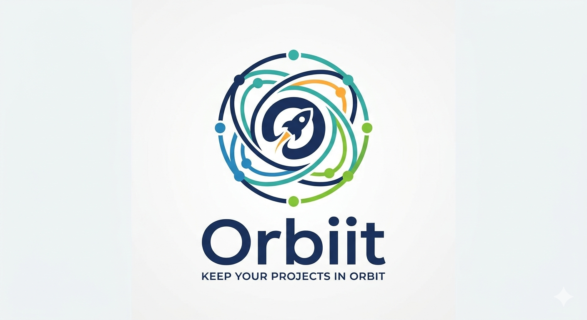

<p align="center">
  
</p>

# Orbiit — Keep Your Projects in Orbit

A full-stack project management platform built with the MERN stack. Orbiit helps teams organize workspaces, manage projects, and track tasks with role-based access control.

## Features

- **Workspaces** — Create isolated workspaces for different teams or organizations
- **Role-Based Access Control** — Owner, Admin, and Member roles with granular permissions
- **Project Management** — Create and organize projects within workspaces with emoji identifiers
- **Task Tracking** — Create, assign, and filter tasks by status, priority, assignee, and due date
- **Team Collaboration** — Invite members via shareable invite links
- **Analytics Dashboard** — View workspace and project-level analytics (task completion, overdue tasks, trends)
- **Authentication** — Email/password registration and login with JWT-based sessions

## Tech Stack

### Backend
- **Runtime**: Node.js with Express 4
- **Language**: TypeScript
- **Database**: MongoDB with Mongoose ODM
- **Authentication**: Passport.js (Local + JWT strategies)
- **Validation**: Zod

### Frontend
- **Framework**: React 18 with TypeScript
- **Build Tool**: Vite
- **Styling**: Tailwind CSS + Shadcn UI (Radix primitives)
- **State Management**: Zustand + React Query (TanStack Query)
- **Forms**: React Hook Form + Zod
- **Routing**: React Router v7 (HashRouter)

## Getting Started

### Prerequisites

- Node.js 18+
- MongoDB (local, Docker, or [MongoDB Atlas](https://www.mongodb.com/atlas))

### Setup

1. **Clone the repository**
   ```bash
   git clone <repo-url>
   cd project-management
   ```

2. **Backend**
   ```bash
   cd backend
   npm install
   ```

   Create a `.env` file in `backend/`:
   ```env
   NODE_ENV=development
   PORT=8000
   MONGO_URI=mongodb+srv://<user>:<password>@<cluster>.mongodb.net/<db>
   JWT_SECRET=<your-jwt-secret>
   JWT_EXPIRES_IN=1d
   SESSION_SECRET=<your-session-secret>
   FRONTEND_ORIGIN=http://localhost:5173
   ```

   Seed the roles:
   ```bash
   npm run seed
   ```

   Start the dev server:
   ```bash
   npm run dev
   ```

3. **Frontend**
   ```bash
   cd frontend
   npm install
   ```

   Create a `.env` file in `frontend/`:
   ```env
   VITE_API_BASE_URL=http://localhost:8000/api
   ```

   Start the dev server:
   ```bash
   npm run dev
   ```

4. Open `http://localhost:5173` in your browser.

## Project Structure

```
backend/
  src/
    config/         # App, database, passport, HTTP config
    controllers/    # Route handlers
    enums/          # TypeScript enums/constants
    middlewares/     # Auth, error handling, async wrapper
    models/         # Mongoose schemas
    routes/         # Express route definitions
    seeders/        # Database seeding scripts
    services/       # Business logic layer
    utils/          # Helpers (JWT, bcrypt, RBAC, error classes)
    validation/     # Zod request schemas

frontend/
  src/
    components/     # UI components (sidebar, auth, workspace, etc.)
    context/        # React context providers (auth, query)
    hooks/          # Custom hooks (API, UI, permissions)
    layout/         # Page layouts
    lib/            # API client and utilities
    page/           # Page components
    routes/         # Route definitions
    store/          # Zustand stores
    types/          # TypeScript type definitions
```

## Future Work

- **Google OAuth Integration** — OAuth strategy is scaffolded but requires client credentials (see TODO comments in codebase)
- **Orbiit Branding** — Replace placeholder logo with proper Orbiit brand assets
- **Email Notifications** — Send email invites and task assignment notifications
- **Real-Time Updates** — WebSocket integration for live task board updates
- **File Attachments** — Allow file uploads on tasks and projects
- **Activity Log** — Track and display user actions within workspaces
- **Search** — Full-text search across tasks, projects, and workspaces
- **Dark Mode Refinement** — Polish dark theme across all components
- **Testing** — Add unit and integration tests for backend services and frontend components
- **CI/CD Pipeline** — Automated testing and deployment workflow
- **Password Reset** — Forgot password / reset password flow
- **User Profile** — Profile editing, avatar upload
- **Export** — Export tasks and analytics as CSV/PDF
- **Pre-commit Hooks** — Set up Husky + lint-staged to run ESLint and TypeScript type-checking on staged files before every commit
- **Email Verification** — Require users to verify their email address on registration before accessing the platform
- **Persistent Sessions** — Keep users logged in across browser restarts using refresh tokens or a sliding JWT session, so re-authentication is only required after an explicit logout or extended inactivity
- **Direct Member Invites** — Allow workspace owners/admins to add members directly by email (with a "+" button) in addition to the existing shareable invite link, similar to how team apps handle direct onboarding
- **Kanban Board View** — Drag-and-drop Kanban board as an alternative to the task list view, with swimlanes per status (Backlog, To Do, In Progress, In Review, Done)
- **Collaborative Whiteboard** — Shared real-time whiteboard per workspace or project for brainstorming and diagramming (e.g. powered by tldraw or Excalidraw)

## License

MIT

